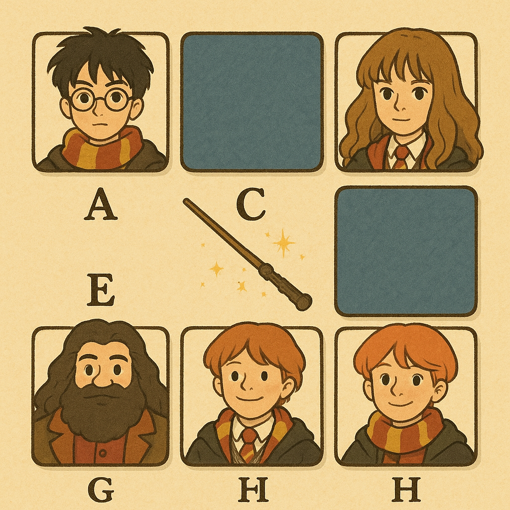

# 🧠 Projeto: Jogo da Memória com HTML, CSS e JavaScript

## 📚 Descrição

Este projeto é uma aplicação web simples de um **jogo da memória**, onde o jogador precisa encontrar pares de cartas iguais. Ao clicar, as cartas "viram" mostrando seu conteúdo. Se forem iguais, permanecem abertas; se forem diferentes, voltam a ficar escondidas após um breve tempo.

Ideal para iniciantes praticarem **manipulação do DOM**, **eventos**, **animações com CSS** e **lógica com JavaScript**.

O aluno deverá explicar todo o projeto e suas tomadas de decisões.

*O tema é livre e de escolha do aluno*



---

## 🧰 Tecnologias Utilizadas

- HTML5
- CSS3
- JavaScript (DOM)

---

## 🧠 Conceitos Praticados

- Estruturação semântica com HTML
- Layout com **grid** e responsividade
- Animações simples com `transform` e `transition`
- Manipulação do DOM com `querySelector`, `classList`, `addEventListener`
- Comparação de elementos com `dataset`
- Lógica condicional e controle de fluxo

---

## 📂 Estrutura de Arquivos

```json

memory-game-app/
├── index.html // HTML Principal
├── style.css // Folha de Estilos
├── script.js // Script Javascript
└── img/  // Imagens dos Cartões
```


Claro! Aqui está uma sugestão de seção de **critérios de avaliação**, adaptada para o público de jovens aprendizes e mantendo um tom educativo, mas objetivo:

---

## 🧪 Critérios de Avaliação

Durante a apresentação e análise do projeto, serão avaliados os seguintes pontos:

| Critério                            | Descrição                                                                                 | Pontuação       |
| ----------------------------------- | ----------------------------------------------------------------------------------------- | --------------- |
| 🎯 **Funcionamento Geral**          | O jogo funciona conforme esperado (vira as cartas, detecta pares, reinicia corretamente). | até 3 pts       |
| 💡 **Criatividade e Tema**          | Escolha do tema, personalização de imagens/cartas e originalidade.                        | até 2 pts       |
| 🧱 **Estrutura HTML**               | Uso correto e semântico das tags HTML (`section`, `div`, `img`, etc).                     | até 1 pt        |
| 🎨 **Estilo com CSS**               | Estilização das cartas, responsividade mínima e animações (flip, hover, etc).             | até 2 pts       |
| 🔁 **Lógica com JavaScript**        | Manipulação correta do DOM, lógica do jogo clara e bem implementada.                      | até 3 pts       |
| 🗣️ **Explicação e Justificativas** | Clareza na explicação do código e das decisões tomadas (tema, estrutura, organização).    | até 2 pts       |
| 🎁 **Desafios Extras (opcional)**   | Implementou um ou mais desafios extras (cronômetro, tentativas, sons, etc).               | até 2 pts bônus |

#

### 📝 Pontuação Total

**Máximo: 13 pontos (com bônus)**
**Nota base: até 11 pontos**

---

## 🎁 Melhorias sugeridas (desafios extras)

* [ ] ✅ Adicionar **cronômetro**
* [ ] ✅ Contador de **tentativas**
* [ ] ✅ Mensagem final de "Parabéns!"
* [ ] ✅ Botão de **reiniciar jogo**
* [ ] ✅ Animações com som (usando `Audio()`)

---

## 🧒 Público-alvo

Esta atividade é voltada para **jovens aprendizes** ou iniciantes em desenvolvimento web, com foco em introdução prática ao **DOM e eventos com JavaScript**.

---

## 📝 Licença

Este projeto é livre para uso educacional.
Você pode modificar, compartilhar e melhorar conforme desejar!

---

> Desenvolvido com ❤️ para quem está começando no mundo da programação!

